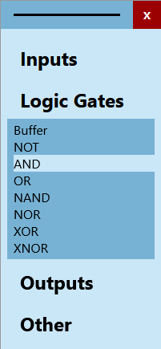

# nand.js

_nand.js_ is an open-source web-based logic circuit simulator.

It's still in development so feedback is welcome ( email: marc.beyer.dev@gmail.com )

## How to use _nand.js_

- To add a gate just klick on the name ( "AND", "OR", "NAND", "Switch", "Lamp", ... ) in the left window (see picture above)
- If you closed this window go to _"Tools -> Open LogicGate-window"_
- Delete gates and connections with the _delete-key_ or the _backspace-key_
- You connect gate inputs and outputs by just clicking on a in-/output and dragging a connection with your mouse
- To change a lable-text take a look at the _ActiveGate-window_ on the right

# TODO

__Make nuber of inputs changeable for basic gates__

__Add more Gates__

1. JK FlipFlop
2. D FlipFlop
3. clock FlipFlops
4. Multiplexer
5. Decoder

__Undo/Redo function__

    Action the user can undo/redo:
    - create a gate
    - delete (a) gate(s)
    - create a connection
    - delete (a) connection(s)
    - move a gate
    - change a lable-text

__Clock-control__

__Timing-diagram integration__

__Design__
